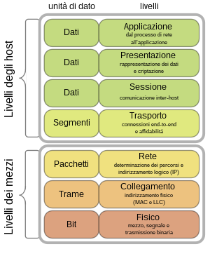
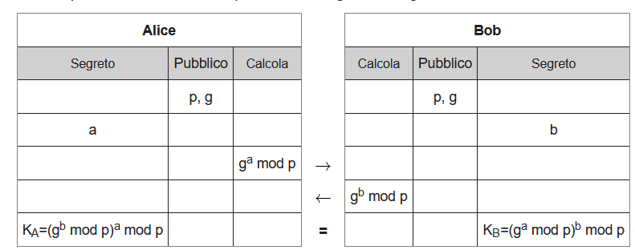

## Resoconto Primo Quadrimestre 2022-23

### Modello ISO-OSI
#### Cos'è il modello ISO-OSI
Per modello ISO-OSI si intende il modello che e' stato approvato dall'**International Standards Organization**, ed e' utilizzato come primo passo per l'assegnazione dei protocolli nei vari livelli.

Questo modello prende il nome di OSI, ovvero **Open System Interconnection**.

I livelli del modello OSI sono 7:
- 1 - Livello fisico
- 2 - Livello DataLink
- 3 - Livello Network
- 4 - Livello di transporto
- 5 e 6 - Livelli di sessione e presentazione
- 7 - Livello di Applicazione

Bella immagine eh?

Ovviamente ognuno di questi livelli ha uno suo scopo:

#### 1 - Livello fisico
>Il livello fisico si occupa semplicemente di **controllare la rete, gli hardware che la compongono e i dispositivi che permettono di stabilire, mantenere e disattivare una connessione o un collegamento fisico.**
>
>Inoltre, questo livello decide diverse altre cose, come il numero di bit per un collegamento, la durata in microsecondi che identifica un bit, la modulazione e la codifica utilizzata, e altro.
>
>Alcuni apparecchi che lavorano a questo livello sono i modem e gli hub.
- Servizi come il Bluetooth e' gestito in questo livello

#### 2 - Livello DataLink
>Il livello DataLink si occupa di permettere il **trasferimento affidabile di dati attraverso il livello fisico**. Invia frame di dati con la necessaria sincronizzazione ed effettua un controllo degli errori e delle perdite di segnale. Tutto ciò consente di far apparire, al livello superiore, il mezzo fisico come una linea di trasmissione esente da errori di trasmissione.
>
>A questo livello e' assegnato anche una unita' di dati fondamentale, ovvero il **frame**.
>
>Gli apparecchi a questo livello sono switch e bridge.
- Sono gestiti protocolli come Ethernet e Wi-Fi

#### 3 - Livello Network
>Obiettivo: rendere i livelli superiori indipendenti dai meccanismi e dalle tecnologie di trasmissione usate per la connessione e prendersi carico della consegna a destinazione dei pacchetti.
>
>E' Responsabile del routing e della conversione dei dati nel passaggio fra una rete e l'altra 
>
>A questo livello lavorano i router
- E' gestito qui il protocollo IP

#### 4 - Livello trasporto, sessione e presentazione
>Livelli meno importanti, che sostanzialmente permettono il trasferimento di dati trasparente e affidabile(**trasporto**), controllare la comunicazione tra applicazioni(**Sessione**) e trasformare i dati forniti dalle applicazioni in un formato standardizzato e offrire servizi come la crittografia(**Presentazione**)
- Qui sono gestiti protocolli come TCP e UDP

#### 5 - Livello Applicazione
>Questo livello si occupa delle funzioni di interfaccia tra utente e macchina
- Sono gestiti tutti i protocolli di servizio, come il DHCP e il DNS, di accesso a terminali remoti, come l'SSH, protocolli di posta elettronica, come l'SMTP, il POP e l'IMAP, e di trasferimento file, come l'FTP e l'HTTP.

### Protocolli
#### Cos'è un protocollo?
>Un protocollo, in informatica, equivale a un insieme di regole che definiscono la modalità di comunicazione tra due o più entità.

I protocolli più usati, o comunque che hanno una maggiore rilevanza, sono:
- HTTP/S
	- Ovvero l'**Hypertext Trasfer Protcol / Secure**, protocollo utilizzato per di più nei siti web
- TCP e UDP
	- Ovvero il **Transmission Control Protocol** e lo **User Datagram Protocol**, protocolli utilizzati con lo scopo di rendere una connessione affidabile tra due host.
- IP
	- l'**Internet Protocol**, protocollo su cui sostanzialmente è basato internet.
	  Ad oggi ne esistono di due versioni, l'*IPv4* e l'*IPv6*, la cui differenza è la grandezza e la quantità di indirizzi disponibili.

#### SSH e Tunneling SSH
Visto che stiamo parlando di protocolli, direi di includere un altro importante protocollo, ovvero il Secure SHell.
>Il Secure Shell è un protocollo che permette di **creare una sessione remota e protetta da cifratura** tramite riga di comando con un altro host, che potrebbe essere e non nello stesso network.

Ora che abbiamo dato una definizione su che cos'è l'SSH, definiamo anche il Tunneling SSH
>Per Tunneling SSH si intende lo sfruttamento del protocollo SSH per entrare nelle porte più nascoste di un host, con l'obiettivo di renderle pubbliche.
>Il dispositivo che fa esporre una porta viene chiamato **Jump Server**

Esistono due tipi di Tunneling:
- Tunnel Locale
	- Ovvero collegare il client a un server tramite SSH, per poi esporre le porte del server e permettere al client di raggiungere destinazioni che solo il server può raggiungere
		- Se si chiude la console del client, la connessione cade!
		- Il server vede le richieste effettuate dal client(o tramite) come se fosse il server stesso in locale a farle
- Tunnel Remoto
	- L'esatto contrario del tunnel locale, ovvero utilizzare un server per accedere a un client.
		- Ciò permette a più client di connettersi al server per poi collegarsi in modo remoto al client esposto

#### E-Mail
Inoltre, esistono anche alcuni protocolli necessari a far funzionare le applicazioni per la gestione di Email:
- In Entrata, ovvero le Email in arrivo, abbiamo i protocolli **POP/IMAP**
	- *POP* usato dai software
	- *IMAP* usato tipicamente dai browser
- In Uscita, ovvero le Email che vengono inviate, c'è il protocollo **STMP**(Ovvero Simple Mail Transfer Protocol)
Infine, nel sistema delle Email, la posta fa questo percorso:

*Sender* ---> *Server(Transfer Agent)* ---Email---> *Server 2 + Mail Box* ---> *Receiver*

#### Risposte dei server tramite URL/URI
Strano da dire, ma se viene inviato un comando, -ncat \[link o ip\] \[porta\], si può ricevere uhn codice di ritorno che indica lo stato del server:
- 1XX = Informazione
- 2XX = Successo
- 3XX = Ri-diretto
- 4XX = Errore dal Client
- 5XX = Errore dal Server

### Teoria dei codici
#### Entropia di un'informazione
Che cosa si intende innanzitutto per "codice"?
>Un codice è un insieme di parole diverse da quelle che vengono usate comunemente, e che hanno un significato arbitrario, momentaneo.

A questa definizione, possiamo dargli una formula, che punta a ottenere l'informazione di un simbolo data la sua probabilità di comparire.
-> Informazione del Simbolo = - log(Ps) = log(1/Ps)
>I logaritmi utilizzati sono tutti in base 2

Per fare un esempio, se ci sono 16 simboli, e un simbolo compare 8 volte, la probabilità che esso compaia è di 8/16, quindi 1/2, log(2) = 1

Dopo questa premessa, possiamo definire l'*Entropia di un'informazione*.
L'Entropia(Hs) è definita così:
>Hs = Ps\*Is = Ps \* log(1/Ps)
>Detto questo bisogna tenere a mente che se Ps = 0, Hs è indeterminato(0 \* inf), ma tende cmq a 0

Bisogna fare anche alcune specificazioni:
- L'entropia di un'informazione è sempre positiva, infatti un simbolo non può avere una probabilità inferiore a 0
- Si può definire il concetto di **Sorgente**, ovvero un insieme contente i simboli

E basta :P

Date queste informazioni, possiamo comprendere...

#### La codifica Huffman
La codifica Huffman possiamo definirla come un algoritmo che punta alla compressione dei dati.
>Definiamo un paio di cose:
>- La codifica Huffman è un **Codice a lunghezza variabile**, cui all'inizio viene inserito un header
>- Questa codifica calcola, in una stringa, la frequenza di tutti i simboli, e vengono messi in ordine crescente
>	- Facciamo un esempio:
>		- Abbiamo una stringa contenente delle A, B e C, in particolare 5, 4 e 6(in ordine)
>		- Sapendo come funziona questa codifica, le mettiamo in ordine crescente:
>			- B(4) | A(5) | C(6)
>		- A questo punto uniamo le due più a sinistra(B e A), e le mettiamo ad albero.
>		- Abbiamo AB(9) e C(6), che andiamo ad unire, ottenendo il risultato finale ABC(15)

### Crittografia
Diamo una definizione di crittografia
>La crittografia possiamo definirla come un insieme di tecniche usate per rendere un messaggio comprensibile e non, in base se si è il mittente o il destinatario.

#### Crittografia Simmetrica
Il primo tipo di crittografia risale all'epoca dell'impero romano, e in particolare da Caio Giulio Cesare(Sono Pazzi Questi Romani), inventore del *Cifrario Cesare*.
>Il metodo semplice bensì intelligente per essere di qualche millennio fa!
>Giulio Cesare, quando doveva scrivere una pergamena da mandare chissà dove, scriveva prima il messaggio in latino, e poi lo trascriveva applicando un trucco: la lettera "A" veniva scambiata con la "D" e così via, sostanzialmente spostandosi ogni volta di 3 spazi nell'alfabeto, e stabilì che dopo la "Z", si ricominciasse dalla "A".

Il cifrario Cesare è un primo esempio di crittografia simmetrica.
Per intenderci, se poniamo CC(3) come l'algoritmo che sostituisce la lettera con quella tre spazi più avanti, è ovvio che per la decifratura useremo CC-(3). Quindi possiamo definire un algortimo di decfiratura DCC(3) = CC(-3).
Dunque la simmetria sta nel fatto che l'algoritmo usato per decodificare un testo è sostanzialmente lo stesso per codificarlo!

##### Codice Monoalfabetico
Ovvero ogni tipo di codice che "A numero uguale, carattere uguale".
Questo vuol dire anche che il tipo di crittografia rimane simmetrico!

Inoltre questo definisce anche che in tutti i sistemi di cifratura esistono due elementi fondamentali:
- l'algoritmo, ovvero il modo in cui un testo cifrato viene decifrato
- la *Chiave*, ovvero il parametro che permette a un algoritmo di funzionare(in qualche modo)

Ma questo vuol dire che alla fine bisognerebbe provare tutte le chiavi per far funzionare l'algoritmo, nel caso fossi un attaccante.
Anche se fosse un insieme di qualche milione, o anche miliardo, di chiavi, con i sistemi ci computazione che esistono oggi, ci vorrebbero all'incirca qualche centinaio, massimo migliaio, di secondi, per scovare quella giusta e testandole tutte.

Ed è su questo fatto che definiamo che alla fine, la debolezza di un sistema di cifratura simmetrico è la chiave.
Ed è anche su questo che si sono basati per...

#### Crittografia Asimmetrica
Che cosa intendiamo per crittografia asimmetrica?
>La crittografia asimmetrica si basa su il non avere la stessa chiave da ambedue le parti, ma bensì avere una chiave di cifratura e una di decifratura, tutte e due private, e che tramite algoritmo si giunge ad avere una chiave privata comune per poter decifrare il testo cifrato

Facciamo un esempio:
- Definiamo C, algoritmo di cifratura asimmetrica
- Definiamo CK(Chiave di cifratura) e DK(Chiave di decifratura).
- Definiamo anche CT e DT, rispettivamente testo cifrato e decifrato
- Sappiamo che:
	- CT = C(T, CK)
		- Il CT viene inviato alla seconda parte
	- DT = C(CT, DK)
		- DT = T, quindi il protocollo si chiude

Il trucco sta che il destinatario crea sia CK che DK, e invia al mittente, anche in chiaro, CK.
DK no invece, se la tiene segreta. Quindi il mittente una CK per cifrare il testo, che viene inviato e decifrato tramite DK dal destinatario.

Il fatto di usare due chiavi diverse, di cui una nascosta, garantisce più sicurezza!

Dalla crittografia asimmetrica deriva l'algoritmo più importante di questo argomento, ovvero...

##### L'RSA
Questo algoritmo, inizialmente ideato da Diffie e Hellman(chiamato, fantasia la potere, Diffie-Hellman), ma irrealizzabile per diverse ragioni riguardanti appunto il sistema asimmetrico, e successivamente finalizzato da **Rives, Shamir e Adlemann**, permette di negoziare fra le due parti un numero intero e positivo, che poi viene usato per mettere in piedi una chiave sicura per poter creare un sistema di **comunicazione simmetrico**.

L'algortimo funziona così:
>Definiamo le due parti, Alice(A) e Bob(B).
>Alice produce 3 numeri interi e positivi, rispettivamente **a** un numero segreto, **p** un numero primo di discreta dimensione e **g** un numero generatore.
>Da questa terna, Alice produce un numero **A = (g^a)%p**, che viene inviato nel peggior modo possibile a Bob, che genera un suo numero segreto **b**.
>Bob calcola **B = (g^b)%p**, che viene rimandato allo stesso peggior modo ad Alice.
>
>A questo punto vengono calcolati:
>- Alice calcola Ka = B^a % p
>- Bob calcola Kb = A^b % p
>- E sappiamo che Ka = Kb(che potrei dimostrare).
>Dunque Ka = Kb => K, ovvero la chiave che verrà utilizzata per la cifratura e decifratura dei messaggi.

### Algebra Astratta
Detto questo, il continuo è su [[Sistemi-TPS 14-12-2022]]
